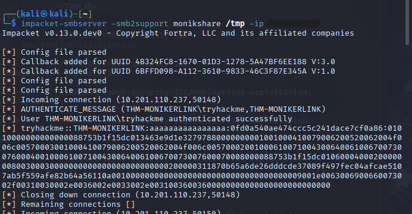

# [Moniker Link (CVE-2024-21413)] - Exploitation Report

## 1. Overview
- Lab Name: [TryHackMe Cyber Security 101 - First Explotation]
- Date Completed: [2025-08-24]
- Exploit: [Outlook Moniker Link Bypass (CVE-2024-21413)]
- Tools Used: [Inpacket,Outlook]

## 2. Objective
Use a malicious moniker link to Capture NTLMv2 hash via SMB!

## 3. Steps Taken
1. Connect to THM OpenVPN server.
2. Start a SMB Server on my IP VPN using Inpacket.
3. Create a exploit.py script to send a email with the malicious moniker link vunerability.
4. Get on the SMB server terminal the username and NTMLv2 hash of the email owner.

## 4. Findings
- Compromised NTLMv2-SSP client: 10.201.110.237,50164
- Compromised NTLMv2-SSP User: THM-MONIKERLINK\tryhackme
- Compromised NTLMv2-SSP Hash: 
  - tryhackme::THM-MONIKERLINK:aaaaaaaaaaaaaaaa:eb867e49f95e970b4c0e2037c9f5a5ee:010100000000000080ff03421f15dc01dbcf55baa9c0bd930000000001001000410079006200520062004f006c00570003001000410079006200520062004f006c005700020010006100710043006400610067007300760004001000610071004300640061006700730076000700080080ff03421f15dc0106000400020000000800300030000000000000000000000000200000311870b65a6de26dddcde37089f497fec04afcae5107ab5f559afe82b64a56110a0010000000000000000000000000000000000009001e0063006900660073002f00310030002e0036002e0033002e00310036003600000000000000000000000000

## 5. Conclusion
The Moniker Link Exploit successefuly get the victmy user and hash!

## 6. Screenshots

